
# Школа QA_GURU. Поток 37. Дипломный проект. 
# Автоматизация тестирования для:
# 1. UI-тест [](https://www.onliner.by/)

> Onliner.by — это крупнейший белорусский интернет-порта́л и онлайн-магазин
# 2. API-тест [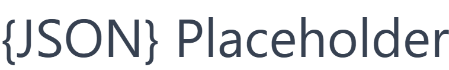](https://jsonplaceholder.typicode.com/) 

> JSONPlaceholder — это фейковое REST API для тестирования и прототипирования.
# 3. Mobile-тест [](https://play.google.com/store/apps/details?id=randomappsinc.com.sqlpracticeplus&hl=ru)

> SQL Practice PRO — Мобильное приложение. Практические упражнения на языке SQL.

## **Содержание:**
____

* <a href="#tools">Технологии и инструменты</a>

* <a href="#cases">Примеры автоматизированных тест-кейсов</a>

* <a href="#jenkins">Сборка в Jenkins</a>

* <a href="#console">Запуск из терминала</a>

* <a href="#allure">Allure отчет</a>

* <a href="#jira">Интеграция с Jira</a>

* <a href="#testops">Интеграция с Allure TestOps</a>

* <a href="#telegram">Уведомление в Telegram при помощи бота</a>

* <a href="#video">Примеры видео выполнения тестов на Selenoid</a>

* <a href="#androidvideo">Примеры видео выполнения тестов на эмуляторе Android Studio</a>
____
<a id="tools"></a>
## <a name="Технологии и инструменты">**Технологии и инструменты:**</a>

<p align="center">  
<a href="https://github.com/allure-framework/allure2"> </a>
<a href="https://qameta.io/"></a>
<a href="https://developer.android.com/"></a>
<a href="https://appium.io/docs/en/latest/"></a> 
<a href="https://gradle.org/"></a>
<a href="https://www.jetbrains.com/idea/"></a>  
<a href="https://www.java.com/"></a>  
<a href="https://www.jenkins.io/"></a>  
<a href="https://www.atlassian.com/ru/software/jira/"></a> 
<a href="https://junit.org/junit5/"></a>  
<a href="https://projectlombok.org/">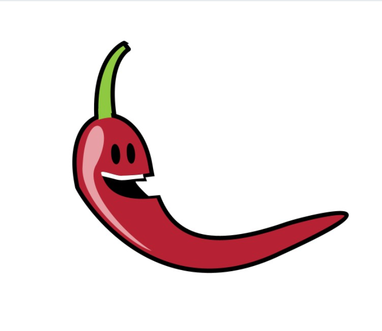</a>  
<a href="https://rest-assured.io/"></a>  
<a href="https://selenide.org/"></a>  
<a href="https://github.com/"></a>  
<a href="https://aerokube.com/selenoid/"></a> 
<a href="https://telegram.org"></a> 
</p>

____
<a id="cases"></a>
## <a name="Примеры автоматизированных тест-кейсов">**Примеры автоматизированных тест-кейсов:**</a>
____
-  *UI-тест.*
   - *Проверка добавление в корзину товара(ноутбук).*
   - *Проверка удаление товара из корзины*
-  *API-тест*
   - *Получение поста по ID*
   - *Изменение поста с Lombok*
   - *Получаем всех пользователей*
   - *Получаем пользователя по ID*
   - *Получаем пользователя по неверному ID*
   - *Создание нового поста*
   - *Удаление поста*
-  *Мобильный тест*
   - *Проверка правильности выполнения SQL-запроса*


____
<a id="jenkins"></a>
## </a><a name="Сборка"></a>Сборка в [Jenkins](https://jenkins.autotests.cloud/job/vplatonov-TempoPizza)</a>
____

- ui_test  - Тест WEB
- api_test -  Тест API
- !!! mobile_test - Только локальный запуск.

### **Параметры сборки в Jenkins:**

- *TASK*
- - *ui_test* - Тест WEB
- - *api_test* - Тест API
- - *!!! mobile_test* - Только локальный запуск.
- *BROWSER (браузер, по умолчанию chrome)*
- *BROWSER_VERSION (Версия браузера)*
- *BROWSER_SIZE (размер окна браузера, по умолчанию 1920x1080)*
- *UI_BASE_URL (Сайт для UI-теста)*
- *API_BASE_URL (Сайт для API-теста)*
- *TELEGRAM_TOKEN (Токен Телеграм-бота)*
- *SELENOID_USER, SELENOID_PASS (логин, пароль для удаленного сервера Selenoid)*

<a id="console"></a>
## Команды для запуска из терминала
___
***Локальный запуск:***
- UI-тест
```bash  
gradle clean ui_test
```
- API-тест
```bash  
gradle clean api_test
```
- Мобильный тест
```bash  
gradle clean mobile_test
```

___
<a id="allure"></a>
## </a> <a name="Allure"></a>Allure отчет</a>
___

### *UI-тест*

<p align="center">  
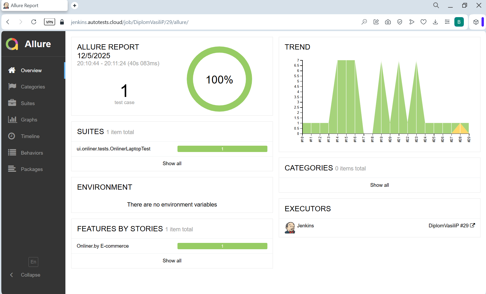 
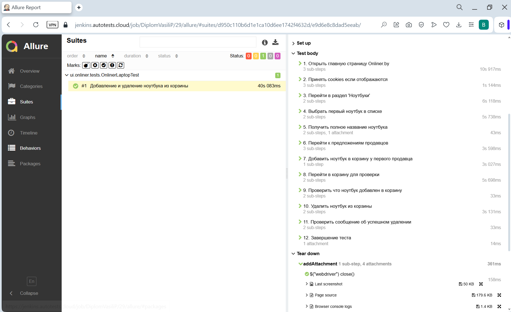 
</p>  

### *API-тест*

<p align="center">  
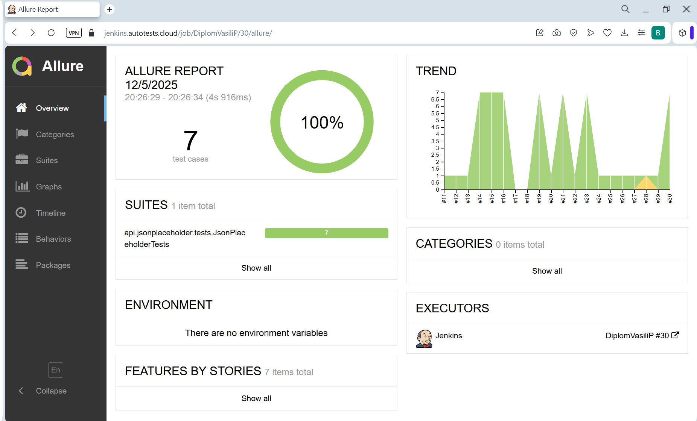 
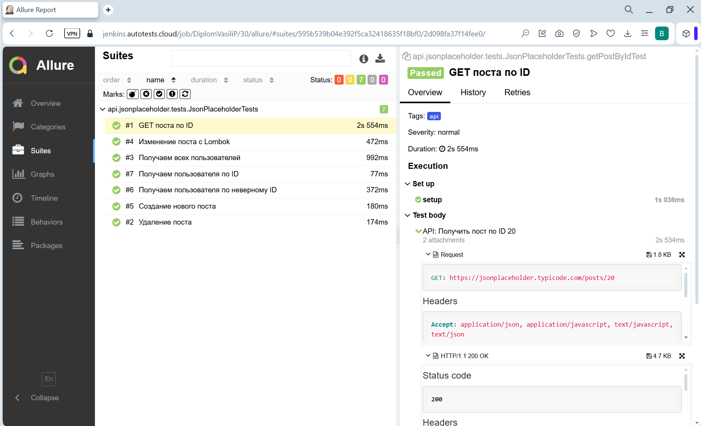 
</p>  

### *Mobile-тест*

<p align="center">  
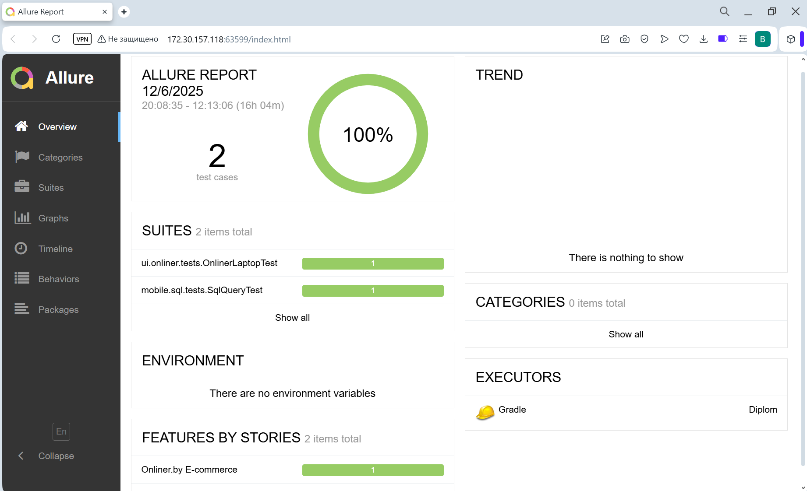 
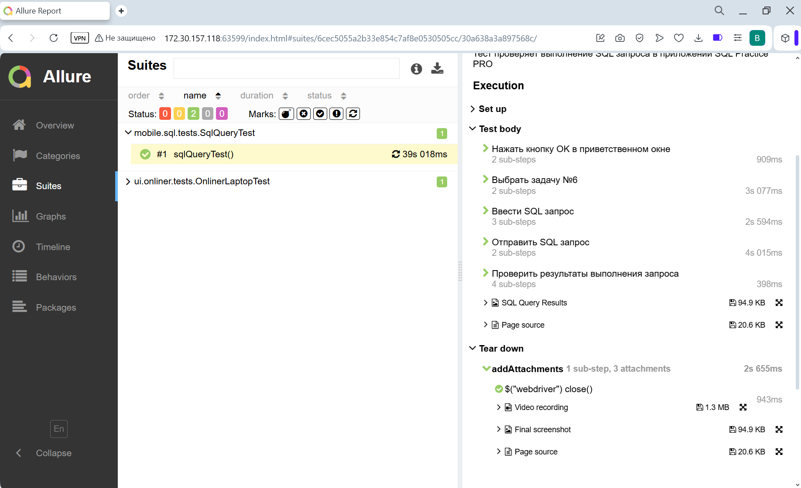 
</p>  

----
<a id="jira"></a>
## </a> <a name="Jira"></a>Интеграция с Jira</a>
<p align="center">  
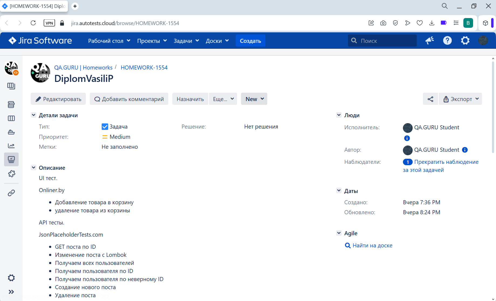 
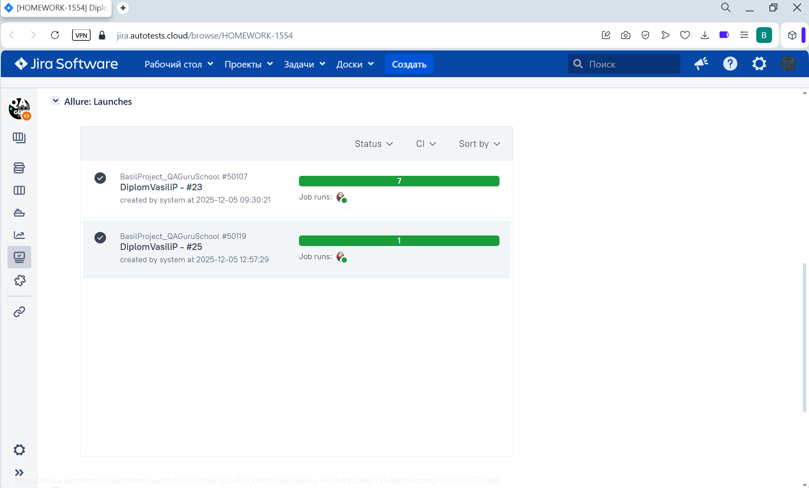 
</p>

----
<a id="testops"></a>
## </a> <a name="TestOps"></a>Интеграция с TestOps</a>
<p align="center">  
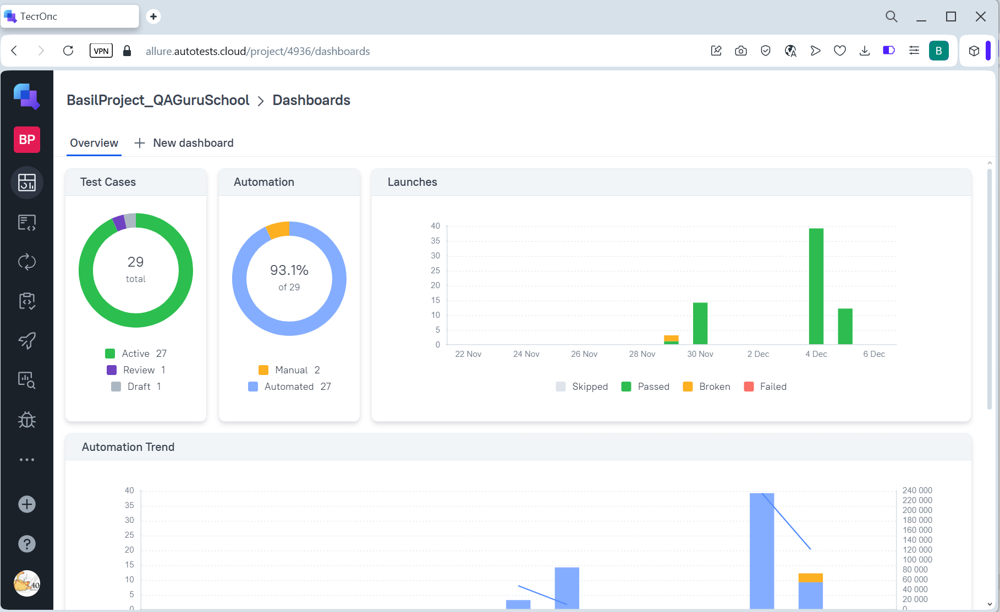 
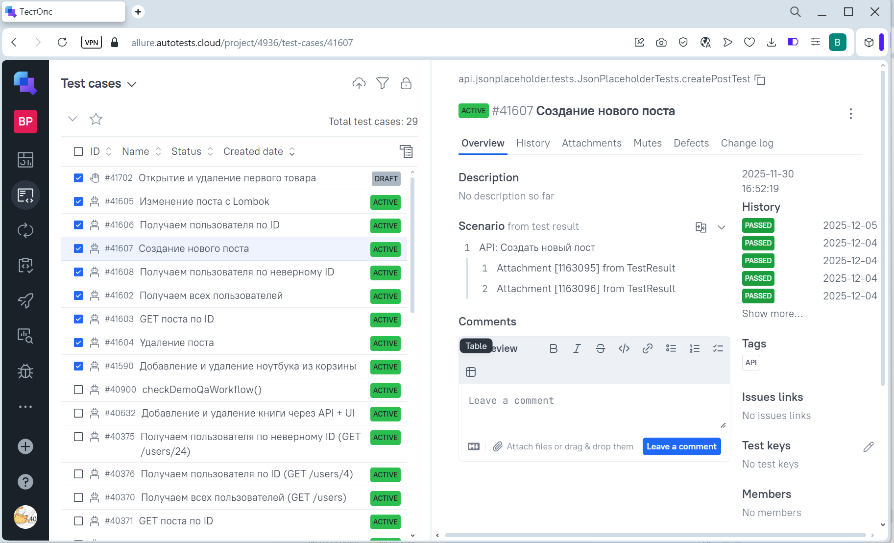 
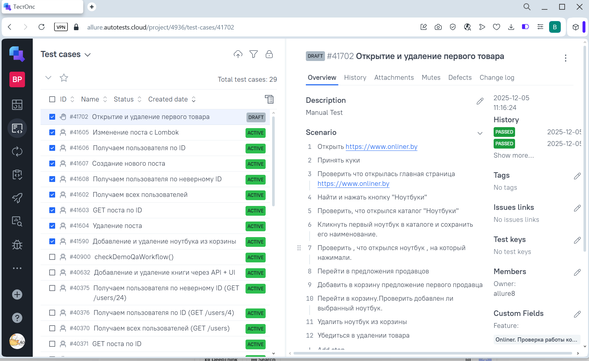 
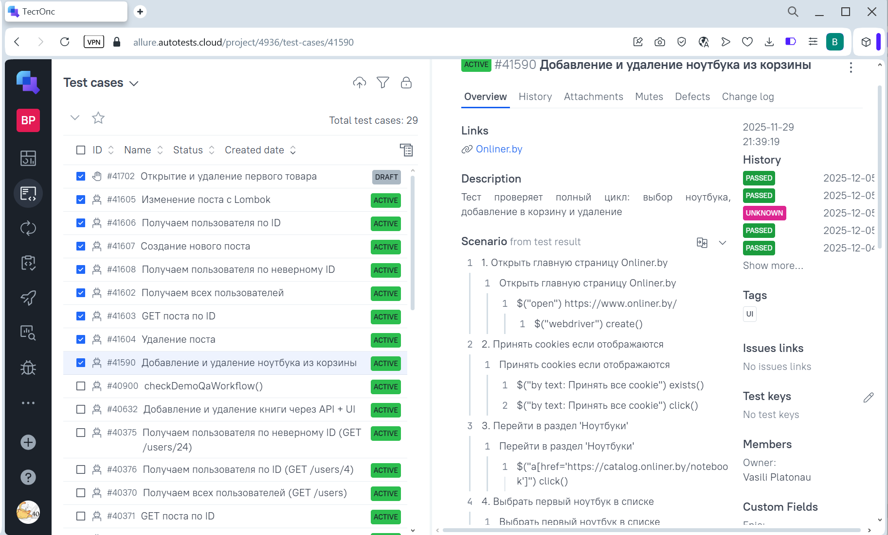 
</p>  

----
<a id="telegram"></a>
## </a> Уведомление в Telegram при помощи бота
____
<p align="center">  
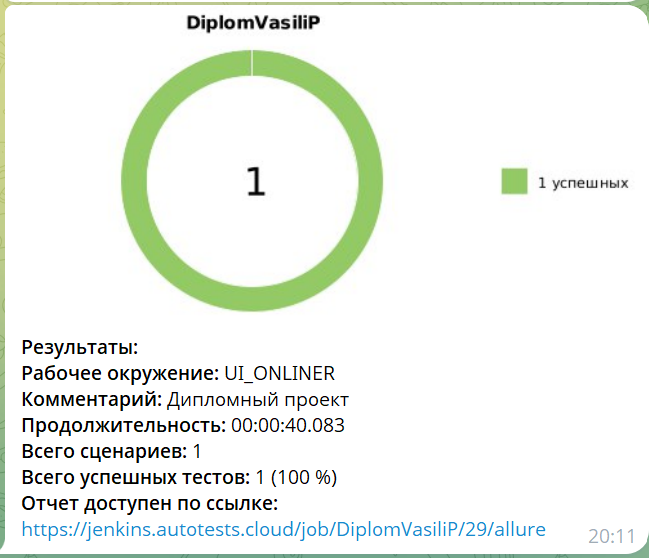  
</p>
<p align="center">  
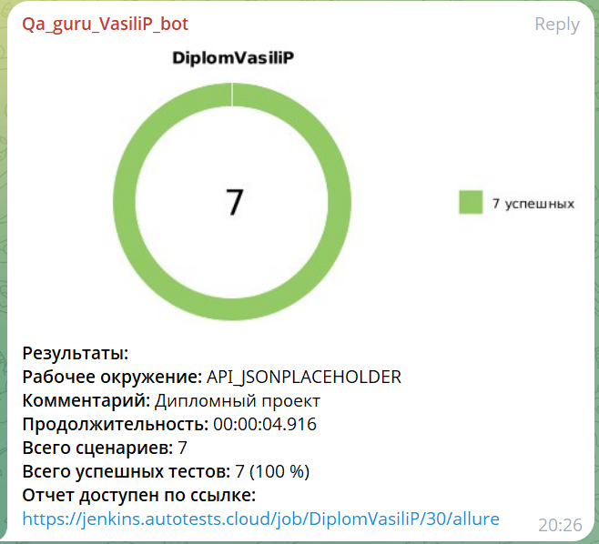  
</p>

____
<a id="video"></a>
## </a> Примеры видео выполнения тестов на Selenoid
____
<p align="center">
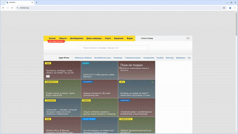   
</p>

<a id="androidvideo"></a>
## </a> Примеры видео выполнения тестов на эмуляторе Android Studio
____
<p align="center">
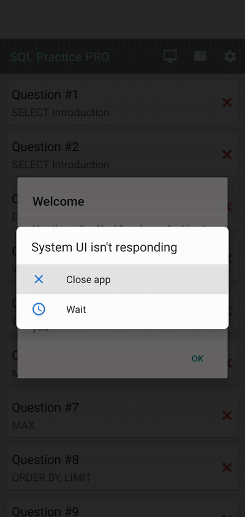   
</p>